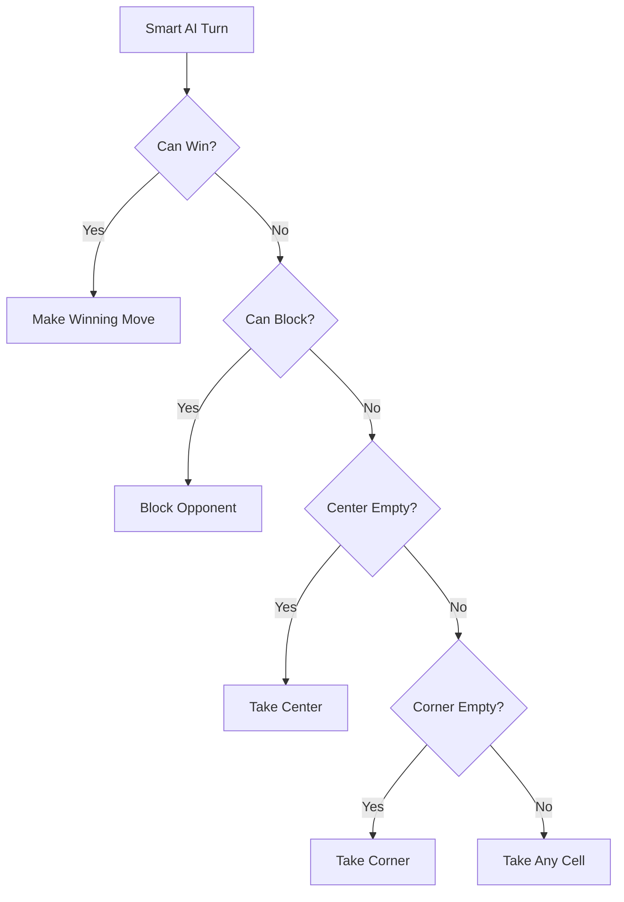
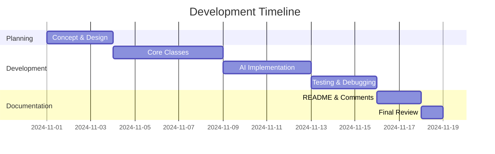

#  Tic-Tac-Toe Game: Java Console Edition

<div align="center">


**A Java Console Game Demonstrating OOP Concepts**

[Features](#-features) • [Installation](#-how-to-run) • [How to Play](#-how-to-play) • [Documentation](#-oop-concepts-used)

---

### 📚 IT-2108 Project

**Created by:**  
👤 Atup, Vincent Jamel S.
👤 Panganiban, Francis Rafael T. 
👤 Silang, Owen Rainier 

[](your-github-repo-link)

</div>

---

## 📋 Table of Contents

- [Overview](#-overview)
- [Features](#-features)
- [OOP Concepts Used](#-oop-concepts-used)
  - [Encapsulation](#1-encapsulation)
  - [Inheritance](#2-inheritance)
  - [Polymorphism](#3-polymorphism)
  - [Abstraction](#4-abstraction)
- [Program Structure](#-program-structure)
- [How to Run](#-how-to-run)
- [How to Play](#-how-to-play)
- [Sample Output](#-sample-output)
- [Acknowledgement](#-acknowledgement)

---

## 🎯 Overview

**Tic-Tac-Toe Game** is a Java-based console application that brings the classic two-player strategy game to life through object-oriented programming principles. Players compete on a 3×3 grid, taking turns to place their symbols (X or O) with the goal of aligning three marks horizontally, vertically, or diagonally.

<div align="center">

| 🎮 Game Modes | 🤖 AI Levels | 📊 Features |
|:---:|:---:|:---:|
| 3 Modes | 2 AI Types | Score Tracking |
| Human vs Human | Random AI | Input Validation |
| Human vs Computer | Strategic AI | Play Again Option |

</div>

### 🎯 Game Objectives

- ✅ Align three symbols in a row (horizontal, vertical, or diagonal)
- ✅ Block your opponent from winning
- ✅ Survive 10 days without hitting 0 Health/Endurance... wait, wrong game! 😄
- ✅ Win as many rounds as possible!

---

## ✨ Features

<table>
<tr>
<td width="33%" align="center">

### 🎮 Three Game Modes

**Human vs Human**  
Two players, one console

**Human vs Computer**  
Challenge random AI

**Human vs Smart AI**  
Battle strategic opponent

</td>
<td width="33%" align="center">

### 🎯 Game Mechanics

✓ Interactive 3×3 grid  
✓ Turn-based gameplay  
✓ Win detection  
✓ Draw detection  
✓ Input validation  
✓ Score tracking  

</td>
<td width="33%" align="center">

### 🤖 Player Types

**HumanPlayer**  
Console input control

**ComputerPlayer**  
Random move generator

**SmartComputerPlayer**  
Strategic AI algorithm

</td>
</tr>
</table>

### 🎲 Smart AI Strategy



---

## 🧩 OOP Concepts Used

### **1. Encapsulation** 🔒

<details>
<summary><b>Click to expand</b></summary>

Encapsulation ensures data integrity by controlling access to the internal state of objects through proper use of access modifiers and methods.

#### Key Implementation:

- **Private Fields**: All class attributes are declared as `private`
  ```java
  private String name;
  private char symbol;
  private int score;
  ```

- **Controlled Access**: Public getter and setter methods
  ```java
  public String getName() { return name; }
  public void incrementScore() { this.score++; }
  ```

- **Data Protection**: Board grid is encapsulated
  ```java
  private char[][] grid;  // Cannot be accessed directly
  ```

#### Benefits:
✅ Prevents unauthorized data manipulation  
✅ Maintains game state integrity  
✅ Enables validation logic in setters  

</details>

---

### **2. Inheritance** 🌳

<details>
<summary><b>Click to expand</b></summary>

The code establishes a clear hierarchy using inheritance to promote code reuse, consistency, and extensibility.

#### Class Hierarchy:

```
Player (Abstract)
    ├── HumanPlayer
    ├── ComputerPlayer
    └── SmartComputerPlayer
```

#### Key Implementation:

```java
public abstract class Player {
    private String name;
    private char symbol;
    private int score;
    
    public Player(String name, char symbol) {
        this.name = name;
        this.symbol = symbol;
        this.score = 0;
    }
    
    public abstract int[] makeMove(Board board);
}

public class HumanPlayer extends Player {
    public HumanPlayer(String name, char symbol) {
        super(name, symbol);  // Inherits parent's fields
    }
    
    @Override
    public int[] makeMove(Board board) {
        // Human-specific implementation
    }
}
```

#### Benefits:
✅ Code reuse across player types  
✅ Consistent structure for all players  
✅ Easy to add new player types  

</details>

---

### **3. Polymorphism** 🔄

<details>
<summary><b>Click to expand</b></summary>

Polymorphism allows the game to treat different player types uniformly while maintaining their unique behaviors.

#### Key Implementation:

```java
// Polymorphic behavior - same call, different implementations
Player player1 = new HumanPlayer("Alice", 'X');
Player player2 = new SmartComputerPlayer("Bot", 'O');

// Dynamic dispatch at runtime
int[] move = currentPlayer.makeMove(board);
```

#### Method Overriding:

| Player Type | makeMove() Behavior |
|------------|---------------------|
| HumanPlayer | Reads console input |
| ComputerPlayer | Generates random moves |
| SmartComputerPlayer | Strategic algorithm |

#### Benefits:
✅ Unified interface for all players  
✅ Flexible game mode switching  
✅ Clean, maintainable code  

</details>

---

### **4. Abstraction** 📦

<details>
<summary><b>Click to expand</b></summary>

Abstraction focuses on defining essential contracts and hiding implementation details.

#### Key Implementation:

**Abstract Class:**
```java
public abstract class Player {
    public abstract int[] makeMove(Board board);  // Contract
}
```

**Interface:**
```java
public interface GameRules {
    char checkWinner(Board board);
    boolean isDraw(Board board);
    boolean isValidMove(Board board, int row, int col);
}
```

**Implementation:**
```java
public class TicTacToeRules implements GameRules {
    @Override
    public char checkWinner(Board board) {
        // Complex win-checking algorithm hidden here
    }
}
```

#### Benefits:
✅ Hides implementation complexity  
✅ Focuses on "what" not "how"  
✅ Clean separation of concerns  

</details>

---

## 📁 Program Structure

```
TicTacToeGame/
 ├── TicTacToeGame.java              # 🚀 Entry point and main menu
 │
 ├── game/
 │   ├── Game.java                   # 🎮 Game controller and flow
 │   ├── Board.java                  # 📋 3×3 grid management
 │   ├── GameRules.java              # 📜 Interface for game logic
 │   └── TicTacToeRules.java         # ✅ Win/draw detection
 │
 ├── player/
 │   ├── Player.java                 # 👤 Abstract base class
 │   └── types/
 │       ├── HumanPlayer.java        # 🧑 Console input player
 │       ├── ComputerPlayer.java     # 🤖 Random AI
 │       └── SmartComputerPlayer.java# 🧠 Strategic AI
 │
 └── utility/
     ├── Scanner                     # ⌨️ Input handling
     └── Random                      # 🎲 Random generation
```

### 🔍 Class Descriptions

<details>
<summary><b>TicTacToeGame.java</b> - Main entry point</summary>

- Displays welcome screen and game mode menu
- Handles user input with exception handling
- Initializes player objects based on selected mode
- Creates and starts Game instance

</details>

<details>
<summary><b>Game.java</b> - Game controller</summary>

- Manages overall game flow and state
- Coordinates Board, Players, and GameRules
- Implements game loop (turns, win/draw checking)
- Handles score tracking and play-again logic

</details>

<details>
<summary><b>Board.java</b> - Game board</summary>

- Encapsulates 3×3 grid (2D char array)
- Provides move validation methods
- Handles board display and reset
- Ensures data integrity

</details>

<details>
<summary><b>Player.java</b> - Abstract player</summary>

- Base class for all player types
- Common attributes: name, symbol, score
- Abstract `makeMove()` method
- Score management methods

</details>

<details>
<summary><b>GameRules Interface</b> - Game logic contract</summary>

- Defines required methods for game rules
- Implemented by TicTacToeRules
- Win/draw detection interface
- Move validation interface

</details>

---

## 🚀 How to Run

### Prerequisites

<div align="center">

[](https://www.oracle.com/java/technologies/downloads/)

</div>

### 📥 Installation Steps

#### **Method 1: Command Line** (Recommended for Learning)

```bash
# 1. Create project folder
mkdir TicTacToeGame
cd TicTacToeGame

# 2. Save all 9 Java files in this folder
# (Copy code from artifacts above)

# 3. Compile all files
javac *.java

# 4. Run the game
java TicTacToeGame
```

#### **Method 2: VS Code**

1. Install "Extension Pack for Java"
2. Open project folder
3. Press `F5` to run
4. Or right-click `TicTacToeGame.java` → Run

#### **Method 3: IntelliJ IDEA**

1. Create new Java project
2. Add all 9 Java files
3. Right-click `TicTacToeGame.java`
4. Select "Run 'TicTacToeGame.main()'"

#### **Method 4: Eclipse**

1. Create new Java project
2. Add files to `src` folder
3. Right-click → Run As → Java Application

### 📝 Required Files

<table>
<tr>
<td>

✅ Player.java  
✅ HumanPlayer.java  
✅ ComputerPlayer.java  

</td>
<td>

✅ SmartComputerPlayer.java  
✅ GameRules.java  
✅ TicTacToeRules.java  

</td>
<td>

✅ Board.java  
✅ Game.java  
✅ TicTacToeGame.java  

</td>
</tr>
</table>

---

## 🎮 How to Play

### Step-by-Step Guide

<table>
<tr>
<td width="50%">

### 1️⃣ Start the Game

```
========================================
     TIC-TAC-TOE GAME
========================================

Select Game Mode:
1. Human vs Human
2. Human vs Computer (Easy)
3. Human vs Smart Computer
4. Exit

Enter your choice: _
```

</td>
<td width="50%">

### 2️⃣ Choose Game Mode

- **Option 1**: Play with a friend
- **Option 2**: Practice against AI
- **Option 3**: Challenge yourself
- **Option 4**: Exit game

</td>
</tr>
<tr>
<td>

### 3️⃣ Enter Player Names

```
Enter Player 1 name: Alice
Enter Player 2 name: Bob
```

Or for vs Computer:
```
Enter your name: Alice
```

</td>
<td>

### 4️⃣ Make Your Moves

```
Alice's turn (X)
Enter row (1-3): 1
Enter column (1-3): 1
```

Board coordinates:
```
  1   2   3
1 _ | _ | _
2 _ | _ | _
3 _ | _ | _
```

</td>
</tr>
<tr>
<td>

### 5️⃣ Win Conditions

**Horizontal:** X X X  
**Vertical:** X / X / X  
**Diagonal:** X ╲ or ╱ X

</td>
<td>

### 6️⃣ Play Again?

```
Winner: Alice (X)

SCOREBOARD:
Alice: 1 win(s)
Bob: 0 win(s)

Play again? (yes/no): _
```

</td>
</tr>
</table>

---

## 📸 Sample Output

### 🎮 Game Start

```
========================================
     TIC-TAC-TOE GAME
========================================
Welcome! Let's play Tic-Tac-Toe!

Select Game Mode:
1. Human vs Human
2. Human vs Computer (Easy)
3. Human vs Smart Computer
4. Exit

Enter your choice: 1

--- Human vs Human Mode ---
Enter Player 1 name: Alice
Enter Player 2 name: Bob
```

### 📋 Gameplay

```
========================================
      NEW GAME STARTED!
========================================
Alice (X) vs Bob (O)

Current Board:
  1   2   3
1   |   |   
  -----------
2   |   |   
  -----------
3   |   |   

Alice's turn (X)
Enter row (1-3): 1
Enter column (1-3): 1

Current Board:
  1   2   3
1 X |   |   
  -----------
2   |   |   
  -----------
3   |   |   

Bob's turn (O)
Enter row (1-3): 2
Enter column (1-3): 2

Current Board:
  1   2   3
1 X |   |   
  -----------
2   | O |   
  -----------
3   |   |   

Alice's turn (X)
Enter row (1-3): 1
Enter column (1-3): 2

Current Board:
  1   2   3
1 X | X |   
  -----------
2   | O |   
  -----------
3   |   |   

Bob's turn (O)
Enter row (1-3): 3
Enter column (1-3): 3

Current Board:
  1   2   3
1 X | X |   
  -----------
2   | O |   
  -----------
3   |   | O

Alice's turn (X)
Enter row (1-3): 1
Enter column (1-3): 3

Current Board:
  1   2   3
1 X | X | X
  -----------
2   | O |   
  -----------
3   |   | O
```

### 🏆 Victory Screen

```
========================================
🎉 GAME OVER! 🎉
========================================
Winner: Alice (X)
========================================

SCOREBOARD:
Alice: 1 win(s)
Bob: 0 win(s)

Play again? (yes/no): yes
```

### 🤖 Smart AI Example

```
Enter your choice: 3

--- Human vs Smart Computer Mode ---
Enter your name: Alice

⚠️  Warning: The Smart Bot is unbeatable! Good luck! 🤖

========================================
      NEW GAME STARTED!
========================================
Alice (X) vs Smart Bot (O)

Current Board:
  1   2   3
1   |   |   
  -----------
2   |   |   
  -----------
3   |   |   

Alice's turn (X)
Enter row (1-3): 1
Enter column (1-3): 1

Current Board:
  1   2   3
1 X |   |   
  -----------
2   |   |   
  -----------
3   |   |   

Smart Bot's turn (O)
Smart Bot is thinking strategically...
Smart Bot chose: Row 2, Column 2 (Center)

Current Board:
  1   2   3
1 X |   |   
  -----------
2   | O |   
  -----------
3   |   |   

Alice's turn (X)
Enter row (1-3): 1
Enter column (1-3): 2

Current Board:
  1   2   3
1 X | X |   
  -----------
2   | O |   
  -----------
3   |   |   

Smart Bot's turn (O)
Smart Bot is thinking strategically...
Smart Bot is blocking opponent!
Smart Bot chose: Row 1, Column 3

Current Board:
  1   2   3
1 X | X | O
  -----------
2   | O |   
  -----------
3   |   |   
```

### ❌ Error Handling

```
Alice's turn (X)
Enter row (1-3): abc
❌ Invalid input! Please enter numbers only.
Enter row (1-3): 5
Enter column (1-3): 2
❌ Invalid coordinates! Enter numbers between 1 and 3.
Enter row (1-3): 1
Enter column (1-3): 1
❌ Cell already occupied! Try again.
Enter row (1-3): 2
Enter column (1-3): 1

✓ Move accepted!
```

---

## 🙏 Acknowledgement

<div align="center">

### 👥 Development Team

**Created by:**

| Name | Role | Contact |
|:----:|:----:|:-------:|
| [Your Name] | Lead Developer | [](your-github) |
| [Partner Name] | Developer | [](partner-github) |
| [Partner Name] | Developer | [](partner-github) |

---

### 📚 Course Information

**Course:** IT-2108 - Object-Oriented Programming  
**Instructor:** [Professor Name]  
**Institution:** [Your University/School]  
**Academic Year:** 2024-2025  
**Semester:** [1st/2nd Semester]

</div>

---

### 💝 Special Thanks

<table>
<tr>
<td align="center" width="33%">

#### 👨‍🏫 Instructors

Our course instructor and teaching assistants for guidance on OOP principles

</td>
<td align="center" width="33%">

#### 👥 Classmates

Study group members for testing, feedback, and collaborative learning

</td>
<td align="center" width="33%">

#### 🌐 Community

Stack Overflow and online resources for troubleshooting support

</td>
</tr>
</table>

---

### 📖 Resources and References

1. **Oracle Java Documentation**  
   [](https://docs.oracle.com/en/java/)

2. **Effective Java (3rd Edition)** by Joshua Bloch  
   Best practices in Java programming

3. **Head First Design Patterns** by Freeman & Freeman  
   Understanding OOP design principles

4. **Java Naming Conventions**  
   [](https://www.oracle.com/java/technologies/javase/codeconventions-namingconventions.html)

5. **Git and GitHub Documentation**  
   [](https://docs.github.com/en)

---

### 📊 Development Statistics

<div align="center">

| Metric | Value |
|:------:|:-----:|
| 📝 Lines of Code | ~600+ |
| 📁 Java Files | 9 |
| 🎮 Game Modes | 3 |
| 🤖 AI Types | 2 |
| ⏱️ Development Time | [X weeks] |
| 🐛 Bugs Fixed | [X] |

</div>

---

### 🚀 Future Enhancements

<details>
<summary><b>Click to see planned features</b></summary>

#### Version 2.0 Roadmap

- [ ] 🎨 Add GUI using JavaFX or Swing
- [ ] 🌐 Implement online multiplayer functionality
- [ ] 📊 Add game statistics and analytics dashboard
- [ ] 📐 Support larger board sizes (4×4, 5×5)
- [ ] 🎚️ Add multiple AI difficulty levels
- [ ] ↩️ Implement move undo/redo functionality
- [ ] 🔊 Add sound effects and animations
- [ ] 💾 Save and load game states
- [ ] 🏆 Create tournament mode with brackets
- [ ] 🎖️ Add achievements and unlockables
- [ ] 🎨 Customizable themes and colors
- [ ] 📱 Mobile app version
- [ ] 🤖 Machine learning AI opponent
- [ ] 📈 Replay system with move analysis

</details>

---

### 📜 License

<div align="center">

[](LICENSE)

This project is created for **educational purposes** as part of the **IT-2108** course requirements.

**All rights reserved by the creators.**

</div>

---

### 📧 Contact

<div align="center">

For questions, suggestions, or bug reports:

[](mailto:your.email@example.com)
[](https://github.com/your-username)

</div>

---

### 📅 Project Timeline



---

<div align="center">

### ⭐ If you found this project helpful, please give it a star!

[](https://github.com/your-username/TicTacToeGame)
[](https://github.com/your-username/TicTacToeGame/fork)

---

**Last Updated:** December 2024

**Version:** 1.0.0

---

### 💬 Final Note

*"Simple game, powerful concepts. Learning OOP through play."* 🎮

**Thank you for checking out our project!**

Made with ❤️ and ☕ by [Your Name] and team

</div>

---

## 🎓 Learning Outcomes

Through this project, we successfully demonstrated:

✅ **Encapsulation** - Data hiding and controlled access  
✅ **Inheritance** - Code reuse through class hierarchies  
✅ **Polymorphism** - Dynamic behavior through method overriding  
✅ **Abstraction** - Hiding complexity behind interfaces  
✅ **Exception Handling** - Robust error management  
✅ **Design Patterns** - Clean, maintainable code structure  

---

<div align="center">

**🎮 Happy Gaming! 🎮**

[Back to Top](#-tic-tac-toe-game-java-console-edition)

</div>
